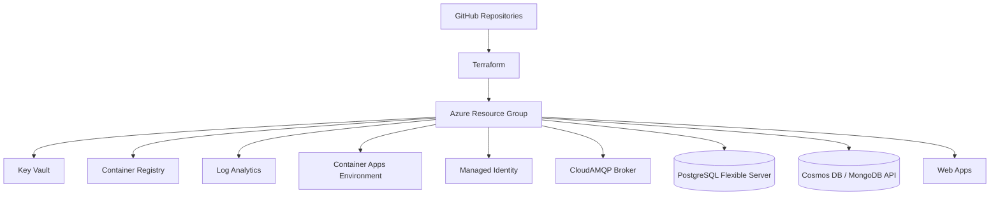

<div align="center">

# 🏗️ HowestPrime Production Infrastructure

**A Terraform-based Azure foundation for deploying the HowestPrime movie platform with repeatable cloud resources and GitHub automation.**

<p>
  
  
  
  
  
  
</p>

</div>

> Infrastructure as code for the shared production environment behind the platform.

## 📑 Table of Contents

- [📖 About](#about)
- [🏗️ Architecture](#architecture)
- [✨ Features](#features)
- [📱 Provisioned Components](#provisioned-components)
- [🛠️ Tech Stack](#tech-stack)
- [🚀 Getting Started](#getting-started)
- [📄 License](#license)
- [👤 Author](#author)

## 📖 About

- This repository provisions the shared Azure and GitHub foundation for the HowestPrime movie platform.
- It keeps the deployment model repeatable across environments by using Terraform.
- The infrastructure supports the client app, the backoffice, the microservices, and the shared messaging layer.
- Sensitive values are expected to stay out of source control and belong in local or secret-managed configuration.

## 🏗️ Architecture



## ✨ Features

**☁️ Azure platform**

- Resource group for the production environment.
- Azure Key Vault for secret storage.
- Azure Container Registry for image hosting.
- Azure Container Apps environment for service hosting.
- Azure Log Analytics workspace for monitoring.
- Managed identity for Azure access.
- Web App hosting for the client-facing site and the backoffice.

**🗄️ Data and messaging**

- PostgreSQL Flexible Server for the movies service.
- Cosmos DB with MongoDB API for the ticketing service.
- CloudAMQP message broker for asynchronous communication.

**🔁 CI/CD**

- GitHub configuration for the application repositories.
- Shared pipeline credentials and deployment automation.
- Azure service principal setup for Terraform and release flows.

## 📱 Provisioned Components

| Component | Purpose |
| --- | --- |
| Resource group | Shared Azure boundary for the platform |
| Key Vault | Secret storage and access control |
| Container Registry | Docker image storage |
| Container Apps environment | Hosting environment for services |
| Log Analytics | Operational monitoring and diagnostics |
| Managed identity | Azure resource authentication |
| Message broker | Event-driven communication backbone |
| PostgreSQL | Movies service database |
| MongoDB API | Ticketing service persistence |
| Web Apps | Client and backoffice hosting |

## 🛠️ Tech Stack

| Area | Technologies |
| --- | --- |
| IaC | Terraform |
| Cloud | Azure |
| CI/CD | GitHub Actions |
| Secrets | Azure Key Vault |
| Runtime hosting | Container Apps, Web Apps |
| Data | PostgreSQL, Cosmos DB / MongoDB API |
| Messaging | CloudAMQP |

## 🚀 Getting Started

### Prerequisites

- Terraform v1.14.5 or newer
- Azure CLI configured for the target subscription
- A valid Azure service principal
- A GitHub personal access token with repository access
- CloudAMQP API credentials
- Required values in `variables.auto.tfvars` and `variables.sensitive.auto.tfvars`

### Initialize

```bash
terraform init
```

### Review the plan

```bash
terraform plan
```

### Apply the infrastructure

```bash
terraform apply
```

After deployment, Terraform updates the downstream repositories with the values they need for build and release automation.


## 📄 License

This project uses the Apache 2.0 License

## 👤 Author

| Name | GitHub | LinkedIn |
| --- | --- | --- |
| Maurice De Kegel | [MriceDK](https://github.com/MriceDK) | [LinkedIn](https://www.linkedin.com/in/dekegelmaurice/) |
